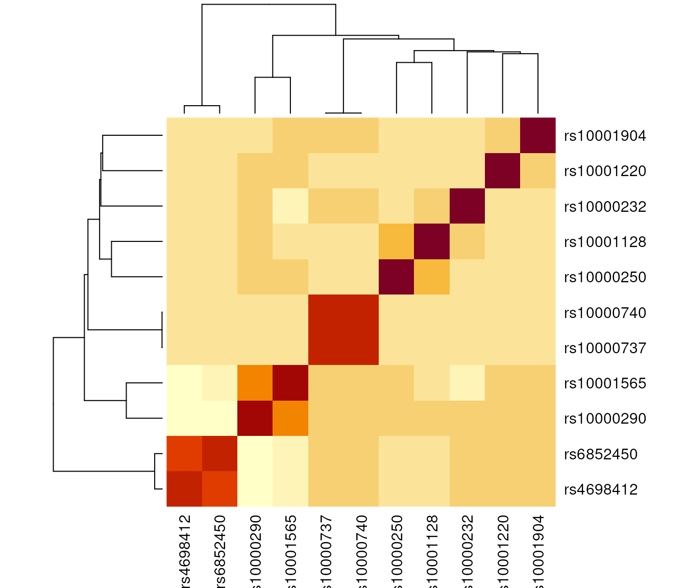

# Getting Started

## Introduction

`echoLD` is an [echoverse](https://github.com/RajLabMSSM/echoverse)
module for retrieving and processing linkage disequilibrium (LD)
matrices. It supports multiple LD reference panels:

- **1000 Genomes** Phase 1 and Phase 3 (computed on-the-fly from VCF)
- **UK Biobank** (pre-computed LD matrices)
- **Custom VCF** files supplied by the user
- **Pre-computed LD matrices** in `.rds`, `.csv`, or `.tsv` format

## Setup

``` r

library(echoLD)
```

The examples below use bundled data from the `echodata` package: a
subset of summary statistics from the *BST1* locus and a pre-computed LD
matrix.

``` r

query_dat <- echodata::BST1[seq_len(50), ]
locus_dir <- file.path(tempdir(), echodata::locus_dir)
LD_matrix <- echodata::BST1_LD_matrix
```

## Pre-computed LD matrix

If you already have an LD matrix on disk,
[`get_LD_matrix()`](https://rajlabmssm.github.io/echoLD/reference/get_LD_matrix.md)
reads it in and aligns it with your summary statistics.

``` r

## Write the bundled LD matrix to a temp CSV to demonstrate the workflow
LD_path <- tempfile(fileext = ".csv")
utils::write.csv(LD_matrix, file = LD_path, row.names = TRUE)

LD_list <- echoLD::get_LD_matrix(
    locus_dir = locus_dir,
    query_dat = query_dat,
    LD_reference = LD_path
)
#> Using custom VCF as LD reference panel.
#> Previously computed LD_matrix detected. Importing: /tmp/RtmpOpB4Go/file616f43163f38.csv
#> LD_reference identified as: table.
#> Converting obj to sparseMatrix.
#> Checking LD metric (r/r2).
#> 45 x 45 LD_matrix (sparse)
#> Converting obj to sparseMatrix.
#> Saving sparse LD matrix ==> /tmp/RtmpOpB4Go/results/GWAS/Nalls23andMe_2019/BST1/LD/BST1.custom_r_LD.RDS
```

## Custom VCF

You can compute LD on-the-fly from any VCF file. The `echodata` package
ships a small 1000 Genomes Phase 3 VCF for the BST1 locus.

``` r

LD_reference <- system.file("extdata", "BST1.1KGphase3.vcf.bgz",
                            package = "echodata")
LD_vcf <- echoLD::get_LD_vcf(
    locus_dir = locus_dir,
    query_dat = query_dat,
    LD_reference = LD_reference
)
#> Using custom VCF as LD reference panel.
#> ========= echotabix::query =========
#> Constructing GRanges query using min/max ranges across one or more chromosomes.
#> + as_blocks=TRUE: Will query a single range per chromosome that covers all regions requested (plus anything in between).
#> Explicit format: 'vcf'
#> Querying VCF tabix file.
#> Querying VCF file using: VariantAnnotation
#> Checking query chromosome style is correct.
#> Chromosome format: 1
#> Retrieving data.
#> Time difference of 0.3 secs
#> Removing 50 / 100 non-overlapping SNPs.
#> Saving VCF subset ==> /tmp/RtmpOpB4Go/VCF/RtmpOpB4Go.chr4-14884541-16649679.BST1.1KGphase3.vcf.bgz
#> Time difference of 0.2 secs
#> Retrieved data with 50 rows across 10 samples.
#> echoLD::snpStats:: `MAF` column already present.
#> echoLD:snpStats:: Computing pairwise LD between 50 SNPs across 10 individuals (stats = R).
#> Time difference of 0 secs
#> 50 x 50 LD_matrix (sparse)
#> Converting obj to sparseMatrix.
#> Saving sparse LD matrix ==> /tmp/RtmpOpB4Go/results/GWAS/Nalls23andMe_2019/BST1/LD/BST1.BST1.1KGphase3.vcf.bgz_LD.RDS
```

## 1000 Genomes (remote)

Querying the full 1000 Genomes VCF requires downloading chromosome-level
VCF files from a remote server. This requires an internet connection and
can take several minutes.

``` r

LD_1kgp3 <- echoLD::get_LD(
    locus_dir = locus_dir,
    query_dat = query_dat,
    LD_reference = "1KGphase3"
)
```

## UK Biobank (remote)

Pre-computed LD from a British European-descent subset of UK Biobank.
**Note:** This takes substantially longer than the 1000 Genomes methods.

``` r

LD_ukb <- echoLD::get_LD(
    locus_dir = locus_dir,
    query_dat = query_dat,
    LD_reference = "UKB",
    download_method = "axel",
    nThread = 10
)
```

## Filtering LD

Use
[`filter_LD()`](https://rajlabmssm.github.io/echoLD/reference/filter_LD.md)
to remove SNPs below a minimum r2 threshold.

``` r

LD_list_full <- list(LD = LD_matrix, DT = echodata::BST1)
LD_list_filt <- echoLD::filter_LD(LD_list = LD_list_full, min_r2 = 0.2)
dim(LD_list_filt$LD)
#> [1] 3 3
```

## Sparse matrix utilities

`echoLD` provides helpers for working with sparse LD matrices, which
reduce file size substantially.

``` r

## Convert a dense matrix to sparse format
sparse_mat <- echoLD::to_sparse(X = LD_matrix)
#> Converting obj to sparseMatrix.
class(sparse_mat)
#> [1] "dsCMatrix"
#> attr(,"package")
#> [1] "Matrix"

## Save to disk
sparse_path <- echoLD::saveSparse(LD_matrix = LD_matrix)
#> Converting obj to sparseMatrix.
#> Saving sparse LD matrix ==> /tmp/RtmpOpB4Go/file616f6c69712f.rds
file.info(sparse_path)$size
#> [1] 22452

## Read it back
sparse_read <- echoLD::readSparse(LD_path = sparse_path)
#> LD_reference identified as: r.
#> Converting obj to sparseMatrix.
dim(sparse_read)
#> [1] 95 95
```

## Plotting LD

Plot a heatmap of pairwise LD around the lead SNP.

``` r

echoLD::plot_LD(
    LD_matrix = LD_matrix,
    query_dat = echodata::BST1,
    span = 10
)
```



## Session Info

``` r

utils::sessionInfo()
#> R Under development (unstable) (2026-03-12 r89607)
#> Platform: x86_64-pc-linux-gnu
#> Running under: Ubuntu 24.04.4 LTS
#> 
#> Matrix products: default
#> BLAS:   /usr/lib/x86_64-linux-gnu/openblas-pthread/libblas.so.3 
#> LAPACK: /usr/lib/x86_64-linux-gnu/openblas-pthread/libopenblasp-r0.3.26.so;  LAPACK version 3.12.0
#> 
#> locale:
#>  [1] LC_CTYPE=en_US.UTF-8       LC_NUMERIC=C              
#>  [3] LC_TIME=en_US.UTF-8        LC_COLLATE=en_US.UTF-8    
#>  [5] LC_MONETARY=en_US.UTF-8    LC_MESSAGES=en_US.UTF-8   
#>  [7] LC_PAPER=en_US.UTF-8       LC_NAME=C                 
#>  [9] LC_ADDRESS=C               LC_TELEPHONE=C            
#> [11] LC_MEASUREMENT=en_US.UTF-8 LC_IDENTIFICATION=C       
#> 
#> time zone: UTC
#> tzcode source: system (glibc)
#> 
#> attached base packages:
#> [1] stats     graphics  grDevices utils     datasets  methods   base     
#> 
#> other attached packages:
#> [1] snpStats_1.61.0  Matrix_1.7-4     survival_3.8-6   echoLD_1.0.0    
#> [5] BiocStyle_2.39.0
#> 
#> loaded via a namespace (and not attached):
#>   [1] DBI_1.3.0                   piggyback_0.1.5            
#>   [3] bitops_1.0-9                rlang_1.1.7                
#>   [5] magrittr_2.0.4              otel_0.2.0                 
#>   [7] matrixStats_1.5.0           compiler_4.6.0             
#>   [9] RSQLite_2.4.6               GenomicFeatures_1.63.1     
#>  [11] dir.expiry_1.19.0           png_0.1-8                  
#>  [13] systemfonts_1.3.2           vctrs_0.7.1                
#>  [15] stringr_1.6.0               pkgconfig_2.0.3            
#>  [17] crayon_1.5.3                fastmap_1.2.0              
#>  [19] XVector_0.51.0              Rsamtools_2.27.1           
#>  [21] rmarkdown_2.30              tzdb_0.5.0                 
#>  [23] UCSC.utils_1.7.1            ragg_1.5.1                 
#>  [25] purrr_1.2.1                 bit_4.6.0                  
#>  [27] xfun_0.56                   aws.s3_0.3.22              
#>  [29] cachem_1.1.0                downloadR_1.0.0            
#>  [31] cigarillo_1.1.0             GenomeInfoDb_1.47.2        
#>  [33] jsonlite_2.0.0              blob_1.3.0                 
#>  [35] DelayedArray_0.37.0         BiocParallel_1.45.0        
#>  [37] echoconda_1.0.0             parallel_4.6.0             
#>  [39] R6_2.6.1                    VariantAnnotation_1.57.1   
#>  [41] bslib_0.10.0                stringi_1.8.7              
#>  [43] reticulate_1.45.0           rtracklayer_1.71.3         
#>  [45] GenomicRanges_1.63.1        jquerylib_0.1.4            
#>  [47] Rcpp_1.1.1                  Seqinfo_1.1.0              
#>  [49] bookdown_0.46               SummarizedExperiment_1.41.1
#>  [51] knitr_1.51                  base64enc_0.1-6            
#>  [53] R.utils_2.13.0              readr_2.2.0                
#>  [55] IRanges_2.45.0              splines_4.6.0              
#>  [57] tidyselect_1.2.1            abind_1.4-8                
#>  [59] yaml_2.3.12                 codetools_0.2-20           
#>  [61] curl_7.0.0                  lattice_0.22-9             
#>  [63] tibble_3.3.1                Biobase_2.71.0             
#>  [65] basilisk.utils_1.23.1       KEGGREST_1.51.1            
#>  [67] evaluate_1.0.5              desc_1.4.3                 
#>  [69] zip_2.3.3                   xml2_1.5.2                 
#>  [71] Biostrings_2.79.5           pillar_1.11.1              
#>  [73] BiocManager_1.30.27         filelock_1.0.3             
#>  [75] MatrixGenerics_1.23.0       DT_0.34.0                  
#>  [77] stats4_4.6.0                generics_0.1.4             
#>  [79] RCurl_1.98-1.17             S4Vectors_0.49.0           
#>  [81] hms_1.1.4                   glue_1.8.0                 
#>  [83] tools_4.6.0                 BiocIO_1.21.0              
#>  [85] data.table_1.18.2.1         openxlsx_4.2.8.1           
#>  [87] BSgenome_1.79.1             GenomicAlignments_1.47.0   
#>  [89] fs_1.6.7                    XML_3.99-0.22              
#>  [91] grid_4.6.0                  tidyr_1.3.2                
#>  [93] echotabix_1.0.1             echodata_1.0.0             
#>  [95] AnnotationDbi_1.73.0        basilisk_1.23.0            
#>  [97] restfulr_0.0.16             cli_3.6.5                  
#>  [99] textshaping_1.0.5           S4Arrays_1.11.1            
#> [101] dplyr_1.2.0                 R.methodsS3_1.8.2          
#> [103] sass_0.4.10                 digest_0.6.39              
#> [105] BiocGenerics_0.57.0         SparseArray_1.11.11        
#> [107] rjson_0.2.23                htmlwidgets_1.6.4          
#> [109] memoise_2.0.1               htmltools_0.5.9            
#> [111] pkgdown_2.2.0               R.oo_1.27.1                
#> [113] lifecycle_1.0.5             httr_1.4.8                 
#> [115] aws.signature_0.6.0         bit64_4.6.0-1
```

\
